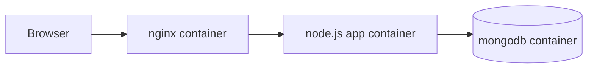

# Octopus Fruits App

Containerized inventory application for the Octopus exercise. The stack uses Node.js, MongoDB, and Nginx, with each component running in its own container.

## Overview

The original requirement was a small web application that reads fruit inventory data from MongoDB and shows the number of apples on an HTML page. I extended that base requirement into a fuller demo with four main improvements:

1. Inventory management
The app now displays all fruit records, not only apples, and lets the user update quantities through the web UI.

2. Backup and restore
The project includes both UI-based and script-based MongoDB backup and restore flows. Backups are written to the host `backups/` directory so they remain available outside the containers,

3. EC2 startup and deployment
The application is deployed to EC2 through GitHub Actions over SSH. On the server side, the stack can be started automatically on reboot with a `systemd` service such as `/etc/systemd/system/octopus-app.service`.

4. Basic password lifecycle separation
MongoDB responsibilities are separated by purpose. The Mongo admin user is used for database initialization, deployment, and user management, while the application itself connects with the application database user. Backup and restore use the same application user, which keeps the design simple while still ensuring that the Mongo admin credential is not exposed inside the app container.

## Architecture

The application is composed of three containers:

- `nginx`: public entrypoint on port `80`
- `app`: Node.js / Express web application
- `mongodb`: MongoDB database

Request flow:

`Browser -> Nginx -> Node.js App -> MongoDB`

## Persistence Model

MongoDB stores its live data in a named Docker volume mounted to `/data/db`.

- If the containers restart normally, the data is preserved.
- If the EC2 instance reboots and the volume still exists, the saved inventory is preserved.
- The default fruit values from `mongo/init.js` are only applied when MongoDB starts with a fresh empty data directory.

This means the application does not reset to the default inventory on every restart. It only returns to the seeded values when the MongoDB volume is recreated from scratch.

## Backup and Restore

The project includes simple MongoDB operational recovery flows.

- Backups are stored on the host machine under `./backups/`.
- Backup files are not committed to Git.
- The web UI can create and restore numbered backup archives.
- Shell scripts are also included for manual operational use.

### Create a Backup

Make sure the stack is running, then run:

```bash
./scripts/backup.sh
```

### Restore a Backup

Run:

```bash
./scripts/restore.sh ./backups/<backup-file>.archive.gz
```

## Deployment

CI/CD is defined in [`.github/workflows/cicd.yml`](./.github/workflows/cicd.yml).

- In CI, the workflow uses `docker compose` on the GitHub runner.
- On EC2, the deploy step uses `docker-compose`, because the target server uses the older Compose binary.
- The workflow writes the environment file, starts MongoDB first, ensures the application user exists, and then starts the app and Nginx containers.

## Environment Variables

For this demo, the sample environment file is intentionally simple.

Example values are provided in [`.env.example`](./.env.example):

```env
MONGO_USERNAME=admin
MONGO_PASSWORD=your-admin-password
MONGO_DB=fruitsdb
APP_PORT=3000
APP_DB_USERNAME=fruits_app
APP_DB_PASSWORD=your-app-password
```

## Security Notes

This project is designed as a demo and exercise, not as a full production platform. Even so, one important improvement was made in the current version:

- the Mongo admin credentials are not passed into the application container
- the app connects with the application database user
- deployment and user-management tasks still use the Mongo admin user

This keeps the runtime application less privileged than the deployment flow.

## Project Structure

```text
.
├── app
│   ├── Dockerfile
│   ├── package.json
│   └── server.js
├── mongo
│   ├── Dockerfile
│   ├── ensure-app-user.js
│   └── init.js
├── nginx
│   ├── Dockerfile
│   └── nginx.conf
├── scripts
│   ├── backup.sh
│   └── restore.sh
├── .github
│   └── workflows
│       └── cicd.yml
├── .env.example
├── docker-compose.yml
└── README.md
```

## Visual Architecture


